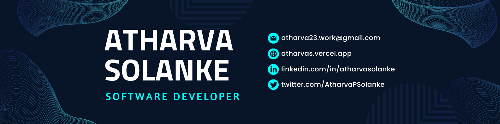

  

###

<h1 align="center">Hi  I'm Atharva Solanke</h1>

    <h3 style="color: black; font-size: 22px; font-family: Arial, sans-serif; margin: 0;">
        Full Stack Developer 💻 Cloud and DevOps 🌐
    </h3>
    

🎓 I’m a third-year Computer Engineering student working on Full Stack, Cloud and Devops !  🌱 I’m currently learning DevOps  🌐 Have a look at my Portfolio : [Portfolio Link](https://atharvas.vercel.app/)  🚀 All of my projects are available at [GitHub Link](https://github.com/AtharvaSolanke)  💬 Ask me about Data Structures, Algorithm Full Stack Development, Cloud, DevOps  📫 How to reach me: atharva23.work@gmail.com  📄 Know about my experiences: [Resume Link](https://drive.google.com/file/d/12QFMR9NhmJ_HBri5zf-1_UJp3i-24Zgl/view)  ⚡ Fun fact: I create Content about Tech... Go to my YouTube Channel  ✍️ My favorite quote 🤔 : " HOPE can drive a man INSANE "

## 🌐 Socials:
     

# 💻 Tech Stack:
                                
# 📊 GitHub Stats:
 
 

## 🏆 GitHub Trophies

---
